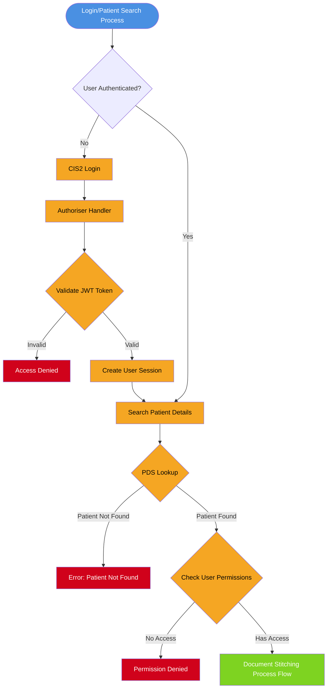
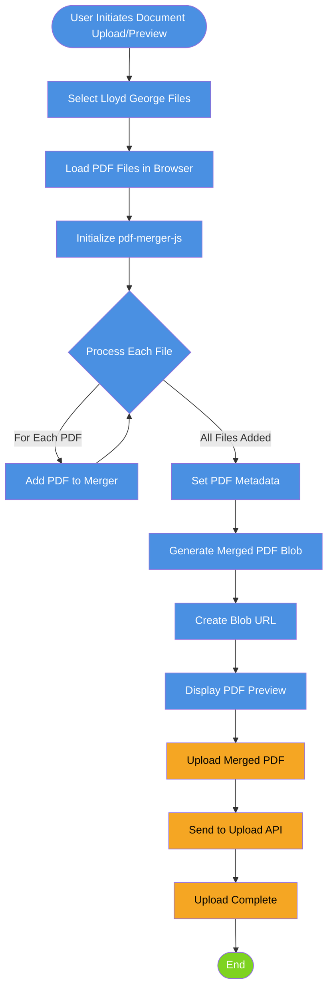

# NHS National Document Repository - Authorization, Document Upload & Stitching Process Flow

[<< Back To README.md](../README.md)

## Overview

These diagrams illustrates the complete document upload process with authorization and document stitching (merging) capabilities in the NHS National Document Repository (NDR) system.

## Legend

- 🟦 **Blue**: Frontend processes (client-side)
- 🟨 **Yellow**: Backend processes (server-side)
- 🟩 **Green**: Success states
- 🟥 **Red**: Error states

## Login and Patient Search Process Flow

## Document Stitching (Lloyd George Records) Process Flow

## Detailed Process Steps

### 1. Authentication & Authorization

- **User Authentication**: Users must authenticate via CIS2 (NHS Care Identity Service)
- **JWT Token Validation**: The `authoriser_handler` validates the JWT token from the Authorization header
- **Session Management**: Valid sessions are created and managed for authenticated users

### 2. Patient Search & Permission Check

- **PDS Lookup**: Patient Demographics Service (PDS) validates patient existence
- **Permission Verification**: System checks if user has appropriate role (GP_ADMIN, GP_CLINICAL, PCSE)
- **Access Control**: User must have permission to access the specific patient's records

### 3. Document Upload Preparation

- **Create Document Reference**: POST to `/DocumentReference` endpoint
- **Generate Presigned URLs**: S3 presigned URLs are generated for secure direct upload
- **Client-Side Upload**: Files are uploaded directly to S3 staging bucket

### 4. Post-Upload Processing

- **Upload State Tracking**: System tracks upload progress via `/UploadState` endpoint
- **Virus Scanning**: All uploaded documents undergo virus scanning
- **File Movement**: Clean files are moved from staging to permanent storage

### 5. Confirmation & Audit

- **Upload Confirmation**: `/UploadConfirm` endpoint confirms successful upload
- **Audit Logging**: All access and uploads are logged via `/AccessAudit` endpoint
- **User Notification**: User receives confirmation of successful upload

## Security Features

1. **Multi-layer Authorization**:

   - CIS2 authentication required
   - JWT token validation
   - Patient-specific access control
   - Role-based permissions

2. **Secure Upload Process**:

   - Presigned URLs with time limits
   - Direct S3 upload (bypasses application server)
   - Virus scanning before permanent storage
   - Staging bucket isolation

3. **Audit Trail**:
   - All actions logged
   - User identity tracked
   - Access patterns monitored
   - Compliance reporting available

## Error Handling

- **Authentication Failures**: Return to login
- **Permission Denied**: Clear error messaging
- **Upload Failures**: Rollback and cleanup
- **Virus Detection**: Quarantine and notification
- **System Errors**: Graceful degradation with user feedback

## Document Stitching Process Details

### Overview

The document stitching feature allows users to merge and preview multiple Lloyd George record files as a single PDF. This happens entirely in the browser using the `pdf-merger-js` library, providing a seamless user experience.

### Client-Side PDF Merging Process

1. **File Selection**:

   - User selects Lloyd George record files for upload or viewing
   - Files are loaded into the browser's memory

2. **PDF Merging (Client-Side)**:

   - `DocumentUploadLloydGeorgePreview` component initializes `pdf-merger-js`
   - Each selected PDF is added to the merger instance
   - Files are validated and merged entirely in the browser
   - No data is sent to the server during merging

3. **Result Handling**:
   - Merged PDF is generated as a blob in browser memory
   - A preview is displayed using the `PdfViewer` component
   - User can then upload the merged file or download it directly

### Alternative: Server-Side ZIP Download

For downloading multiple files without merging:

1. **Document Manifest Job**:

   - Frontend requests a download via `/DocumentManifest` endpoint
   - Backend creates a job to package files into a ZIP
   - Frontend polls for job completion

2. **ZIP Delivery**:
   - Once ready, a presigned URL is generated
   - Files are downloaded as a ZIP archive

### Technical Implementation

- **Frontend Components**:

  - `DocumentUploadLloydGeorgePreview`: Client-side PDF merging using `pdf-merger-js`
  - `LloydGeorgeSelectDownloadStage`: File selection interface
  - `LloydGeorgeDownloadStage`: ZIP download progress tracking

- **PDF Libraries**:
  - `pdf-merger-js`: Browser-based PDF merging
  - `pdfjs-dist`: PDF rendering and viewing

### Performance & Privacy Benefits

- **Client-Side Processing**: PDFs never leave the user's browser during merging
- **Instant Preview**: No server round-trip for merged document preview
- **Reduced Server Load**: Merging happens on user's device
- **Enhanced Privacy**: Sensitive medical records processed locally

## Supported Document Types

- Lloyd George Records (LG) - supports stitching/merging
- Acute Referral Forms (ARF) - individual file downloads only
- Other NHS document types as configured
